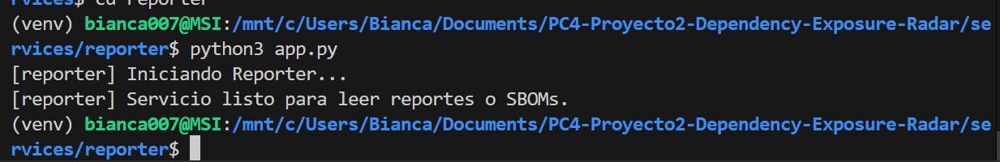
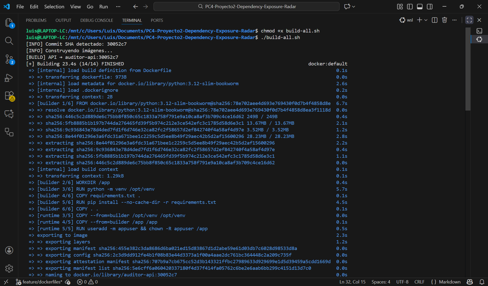
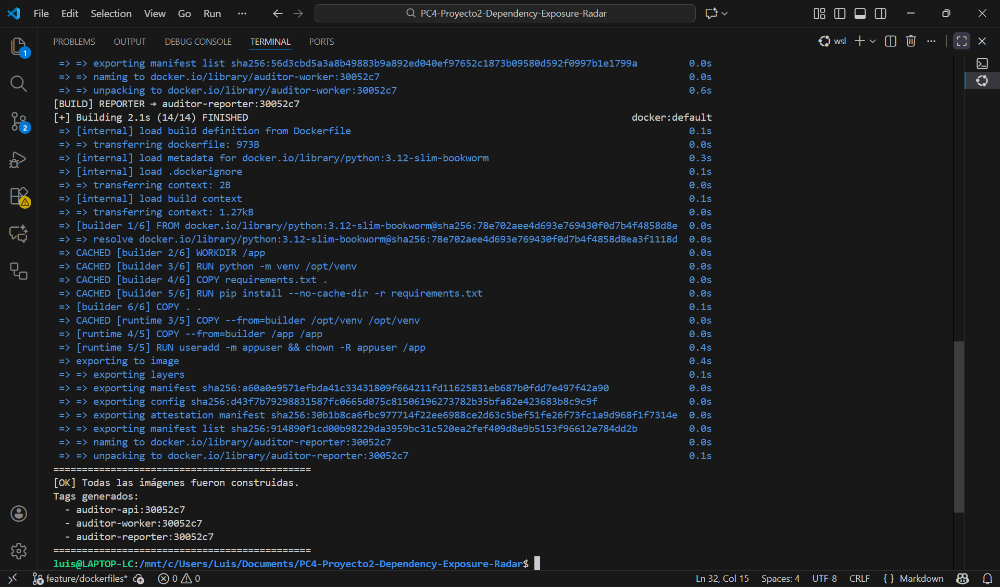
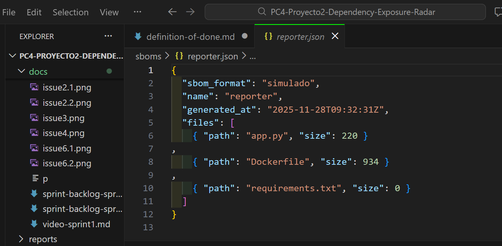
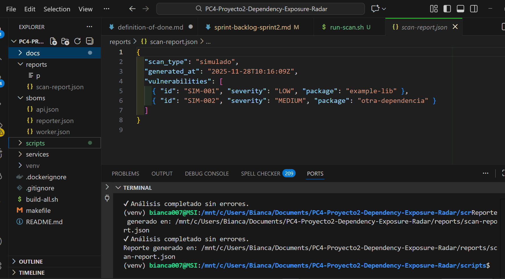

# Proyecto Dependency Exposure Radar

## Ítems Mínimos para Considerar una Historia en Done
Según nuestra rubrica, una historia sólo pasa a Done si cumple:

### 1. Calidad Técnica
- Código Python y Bash sin errores.
- Dockerfiles multi-stage y seguros (USER no root).
- `.dockerignore` aplicado correctamente.

### 2. Pruebas
- `make test` ejecuta sin fallos.
- Scripts Bash ejecutan sin pasos manuales adicionales.

### 3. Seguridad
- SBOM generado correctamente.
- Scan SCA completado.
- Evidencias en `sboms/` y `reports/` generadas.

### 4. Documentación
- README actualizado.
- Comentarios en español en Bash/Python.
- Sin TODO críticos sin justificar.

### 5. Git y Flujo
- Commit limpio sin secretos.
- Rama feature mergeada por PR.
- Tarjeta movida a Done en GitHub Projects.

### 6. Reproducibilidad
- Cualquier persona debe poder ejecutar:
  ```bash
  make build
  make sbom
  make scan


# Evidencias 

## Issue 1


## Issue 2


## Issue 3


## Issue 4



## Issue 5


## Issue 6




## Issue 7





## Issue 7


